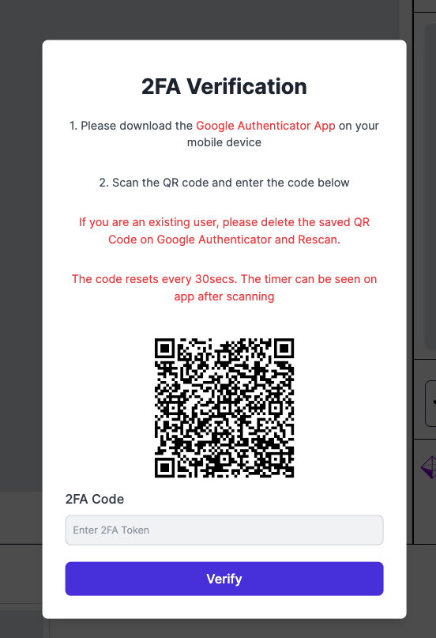
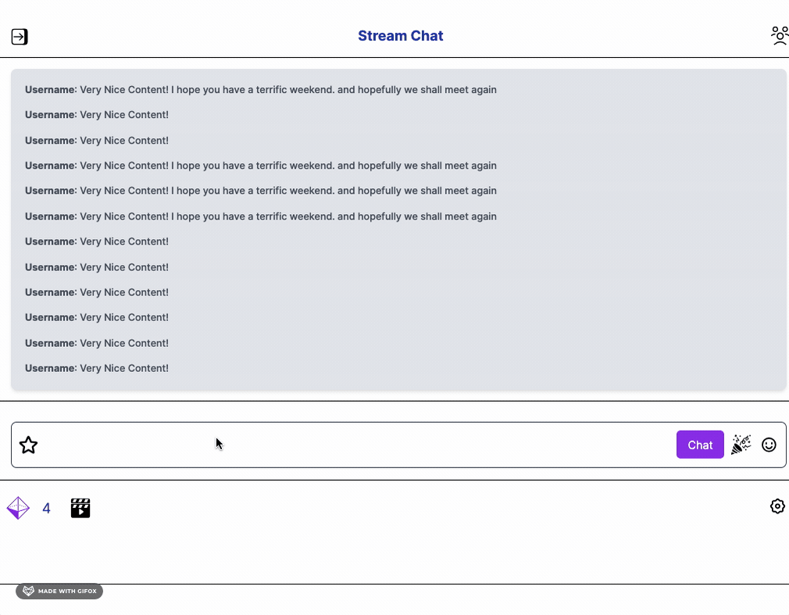

<strong>Fullstack Assignment</strong>

<strong>Overview</strong>

I successfully completed the frontend assignment and finished all backend tasks. The only part pending is setting up WebSocket, which prevented completion of related routes.

<strong>Dependencies Used</strong>

<ul>
  <li><strong>@supabase/supabase-js</strong>: Online PostgreSQL Database.</li>
  <li><strong>axios</strong>: Simplifies requests to other servers or APIs.</li>
  <li><strong>bcryptjs</strong>: Encrypts passwords securely before storage.</li>
  <li><strong>body-parser</strong>: Helps the server handle form or API data.</li>
  <li><strong>cors</strong>: Safely allows interaction with other websites or servers.</li>
  <li><strong>dotenv</strong>: Manages environment variables securely.</li>
  <li><strong>express</strong>: Backend framework for Node.js.</li>
  <li><strong>express-session</strong>: Manages sessions in the backend.</li>
  <li><strong>firebase</strong>: Integrates Google's backend services (databases, auth).</li>
  <li><strong>googleapis</strong>: Provides programmable access to Google services.</li>
  <li><strong>hi-base32</strong>: Converts data for authentication apps like Google Authenticator.</li>
  <li><strong>jsonwebtoken</strong>: Manages security tokens.</li>
  <li><strong>morgan</strong>: Logs activities in the backend.</li>
  <li><strong>next</strong>: React framework.</li>
  <li><strong>nodemailer</strong>: Sends emails from the application.</li>
  <li><strong>otpauth</strong>: Generates codes for two-factor authentication.</li>
  <li><strong>qrcode</strong>: Generates QR codes.</li>
  <li><strong>react</strong>: Frontend framework.</li>
  <li><strong>tailwindcss</strong>: Allows inline styling of HTML elements.</li>
  <li><strong>typescript</strong>: Adds types for more controlled JavaScript projects.</li>
</ul>

<strong>Challenges Faced</strong>

The main challenge was visualizing the user flow and optimizing the user experience. Creating a schema and flowchart (available in the public folder of the GitHub repository) helped map out the user journey and clarify feature requirements. This structured approach provided a clear development direction, easing the implementation of features.

<strong>How to Run the Project</strong>

<strong>A. Running Locally</strong>

<ol>
  <li> Note - I know that .env isn't suppose to be uploaded, I thought I would upload it because if anyone wants to install locally since i cannot get website up. </li>
  <li>Clone the repository from GitHub: <code>git clone &lt;repository-url&gt;</code></li>
  <li>Navigate to the project directory: <code>cd &lt;project-folder&gt;</code></li>
  <li>Install dependencies: <code>npm install</code></li>
  <li>Start the backend server in one terminal: <code>npm run dev:backend</code></li>
  <li>Start the frontend development server in another terminal: <code>npm run dev:frontend</code></li>
  <li>Open your browser and go to <a href="http://localhost:3000">http://localhost:3000</a> to view the application.</li>
</ol>

<strong>B. There gifs that show overall project </strong>

<strong>2FAModal.png</strong>

<strong>ChangeInfo.png</strong>

<strong>ChangePw.png</strong>

<strong>ChannelPage.png</strong>

<strong>ChannelTab.png</strong>

<strong>ChatTrie.gif</strong>

<strong>CreateAccount.png</strong>

<strong>CreateUser.gif</strong>

<strong>Homepage.gif</strong>

<strong>Homepage.png</strong>

<strong>Login2FA.gif</strong>

<strong>LoginModal.gif</strong>

<strong>LoginModal.png</strong>

<strong>NavbarProfile.gif</strong>

<strong>ProfileChannel.gif</strong>

